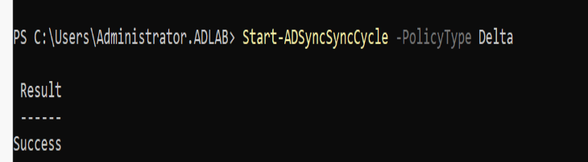
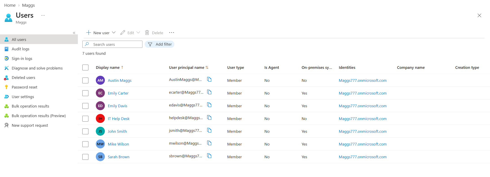

# HYB-006 — Initial Directory Synchronization

## Overview

This ticket validates the Microsoft Entra Connect synchronization process between the on-premises Active Directory environment and Microsoft Entra ID. Rather than reinstalling or reconfiguring Microsoft Entra Connect, this task confirms that the existing hybrid identity deployment is operating correctly by verifying scheduler status, manually triggering a Delta synchronization, and validating synchronized identities within Microsoft Entra.

---

## Objectives

- Verify Microsoft Entra Connect scheduler health.
- Confirm automatic synchronization is enabled.
- Manually initiate a Delta synchronization.
- Validate successful synchronization of on-premises Active Directory users into Microsoft Entra ID.
- Document the synchronization process and results.

---

# Environment

## On-Premises

| Component | Details |
|-----------|---------|
| Domain | adlab.local |
| Domain Controller | DC01 |
| Microsoft Entra Connect Server | SYNC01 |
| Client | CLIENT01 |
| Active Directory | Windows Server 2022 |

## Cloud

| Component | Details |
|-----------|---------|
| Tenant | Maggs777.onmicrosoft.com |
| Identity Platform | Microsoft Entra ID |
| Synchronization | Microsoft Entra Connect Sync |
| Authentication | Password Hash Synchronization (PHS) |

---

# Prerequisites

The following tasks were completed before beginning HYB-006:

- HYB-001 — Active Directory Assessment
- HYB-002 — UPN Suffix Configuration
- HYB-003 — User Principal Name Updates
- HYB-004 — Microsoft Entra Connect Installation
- HYB-005 — OU Filtering Configuration

Current synchronization scope:

Included:

- Users
- Groups
- Computers
- Servers

Excluded:

- Disabled Users
- Service Accounts

Automatic synchronization was already operational with:

- Password Hash Synchronization enabled
- 30-minute synchronization interval
- Delta synchronization
- Staging Mode disabled

---

# Step 1 — Verify Synchronization Scheduler

On **SYNC01**, verify the Microsoft Entra Connect scheduler configuration.

PowerShell:

```powershell
Get-ADSyncScheduler
```

The scheduler confirmed:

- SyncCycleEnabled = True
- CurrentlyEffectiveSyncCycleInterval = 00:30:00
- NextSyncCyclePolicyType = Delta
- StagingModeEnabled = False
- SchedulerSuspended = False

This verifies that Microsoft Entra Connect is actively managing synchronization and operating as the primary synchronization server.

---

# Step 2 — Trigger Manual Delta Synchronization

After confirming no synchronization cycle was currently running, a manual Delta synchronization was initiated.

PowerShell:

```powershell
Start-ADSyncSyncCycle -PolicyType Delta
```

Result:

```
Success
```

This demonstrates that synchronization can be initiated manually without waiting for the scheduled synchronization interval.

---

# Step 3 — Validate Synchronization Completion

The scheduler was checked again after initiating the synchronization.

PowerShell:

```powershell
Get-ADSyncScheduler
```

Verification:

```
SyncCycleInProgress : False
```

This confirmed that the synchronization cycle completed successfully and the synchronization engine returned to its normal idle state.

---

# Step 4 — Validate Synchronized Users

Within the Microsoft Entra Admin Center:

**Identity → Users → All Users**

The synchronized directory objects were verified.

Observed synchronized users included:

- Emily Carter
- Emily Davis
- John Smith
- Mike Wilson
- Sarah Brown

The **On-premises sync** column displayed **Yes** for these accounts, confirming they originated from the on-premises Active Directory environment.

Cloud-only accounts remained independent, demonstrating a properly functioning hybrid identity configuration.

---

# Validation Results

| Validation | Result |
|------------|--------|
| Scheduler Enabled | ✅ |
| Automatic Sync Enabled | ✅ |
| 30-Minute Schedule | ✅ |
| Staging Mode Disabled | ✅ |
| Manual Delta Synchronization | ✅ Successful |
| Synchronization Completed | ✅ |
| On-Premises Users Present in Entra | ✅ |
| Hybrid Identity Functional | ✅ |

---

# Screenshots

## Manual Delta Synchronization



Manual Delta synchronization successfully initiated using PowerShell. This demonstrates a successful administrator-initiated Delta synchronization using Microsoft Entra Connect.

---

## Synchronized Users in Microsoft Entra ID



Microsoft Entra Admin Center displaying synchronized Active Directory users with the **On-premises sync** column confirming successful directory synchronization and hybrid identity integration.

---

# Commands Used

```powershell
Get-ADSyncScheduler

Start-ADSyncSyncCycle -PolicyType Delta
```

---

# Outcome

The Microsoft Entra Connect synchronization engine was successfully validated.

Automatic synchronization is operating correctly, manual Delta synchronization completed successfully, and synchronized Active Directory users were verified within Microsoft Entra ID.

The hybrid identity environment is functioning as expected and is ready for subsequent hybrid identity configuration tasks.

---

## Skills Demonstrated

- Microsoft Entra Connect Administration
- Hybrid Identity
- Active Directory Synchronization
- Microsoft Entra ID
- PowerShell Administration
- Identity Verification
- Password Hash Synchronization (PHS)
- Directory Synchronization Validation
- Microsoft 365 Administration