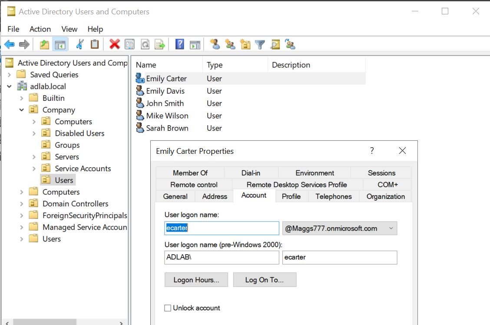
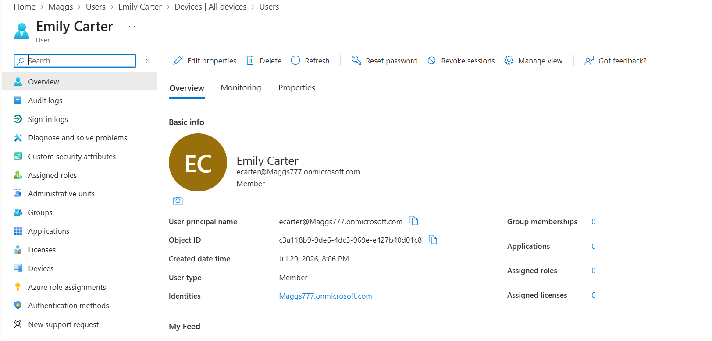
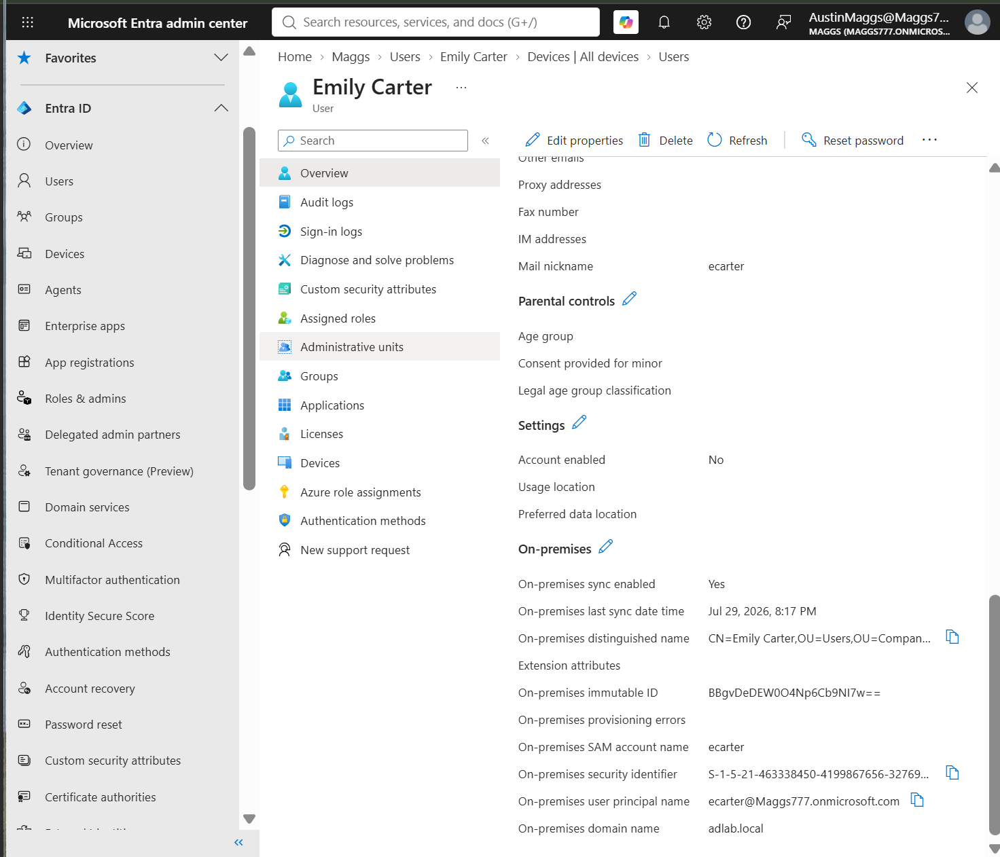
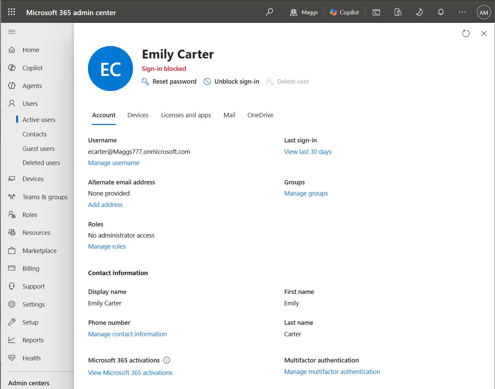
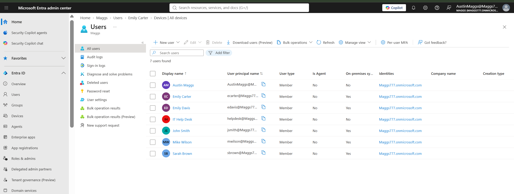

# HYB-007 — Verify Synchronized Users in Microsoft Entra ID

## Overview

After successfully deploying Microsoft Entra Connect and validating directory synchronization in previous tasks, this ticket verifies that synchronized Active Directory user accounts are accurately represented within Microsoft Entra ID and Microsoft 365.

The objective is to confirm that user identities, synchronization metadata, and account status remain consistent between the on-premises Active Directory environment and their corresponding cloud identities.

No configuration changes were made during this task. All activities focused solely on validation using enterprise administration best practices.

---

# Objectives

- Verify synchronized Active Directory user objects exist in Microsoft Entra ID
- Validate User Principal Name (UPN) consistency
- Confirm users are identified as on-premises synchronized identities
- Verify synchronization metadata
- Validate disabled account synchronization
- Confirm synchronized identities appear within Microsoft 365
- Validate synchronization across multiple Active Directory users

---

# Lab Environment

| Component | Value |
|-----------|-------|
| Domain | adlab.local |
| Domain Controller | DC01 |
| Microsoft Entra Connect Server | SYNC01 |
| Client | CLIENT01 |
| Microsoft Entra Tenant | Maggs777.onmicrosoft.com |
| Synchronization Method | Password Hash Synchronization (PHS) |
| Synchronization Schedule | Automatic (Every 30 Minutes) |

---

# Validation 1 — Verify the On-Premises Active Directory User

The Emily Carter Active Directory account was reviewed using **Active Directory Users and Computers** on **DC01** to verify the authoritative on-premises identity before comparing it with Microsoft Entra ID.

## Validation

- Verified User Principal Name (UPN)
- Verified account location within the Company OU
- Confirmed the account exists in Active Directory

## Result

The Active Directory user account was confirmed as the authoritative identity for synchronization.

## Evidence

---

# Validation 2 — Verify the Microsoft Entra ID User

The corresponding Microsoft Entra ID user object was reviewed to confirm that the synchronized cloud identity accurately represents the on-premises Active Directory account.

## Validation

- Verified Display Name
- Verified User Principal Name
- Verified Member user type
- Verified Object ID

## Result

The synchronized Microsoft Entra ID user matched the Active Directory identity.

## Evidence

---

# Validation 3 — Verify Synchronization Metadata

Additional user properties were reviewed within Microsoft Entra ID to verify synchronization metadata generated by Microsoft Entra Connect.

## Validation

Verified the following attributes:

- On-premises synchronization enabled
- Last synchronization time
- Distinguished Name
- SAM Account Name
- User Principal Name
- On-premises domain
- Immutable ID

## Result

Microsoft Entra Connect successfully linked the cloud identity with its corresponding on-premises Active Directory object.

## Evidence

---

# Validation 4 — Verify Microsoft 365 Identity

The synchronized identity was located within the Microsoft 365 Admin Center to verify that Microsoft 365 recognizes the synchronized user.

## Validation

- Verified user exists in Microsoft 365
- Verified User Principal Name
- Confirmed identity is available for Microsoft 365 services
- Verified account status

## Result

The synchronized identity is available for Microsoft 365 licensing and cloud services.

## Evidence

---

# Validation 5 — Verify Multiple Synchronized Users

The Microsoft Entra ID user list was reviewed to confirm synchronization across multiple Active Directory user accounts.

## Validation

Successfully verified synchronization for:

- Emily Carter
- Emily Davis
- John Smith
- Mike Wilson
- Sarah Brown

Also confirmed:

- Cloud-only administrator account (**Austin Maggs**) displays **On-premises sync = No**
- Cloud-only Help Desk account displays **On-premises sync = No**

## Result

Multiple Active Directory users were successfully synchronized according to the configured synchronization scope while cloud-only identities remained independent.

## Evidence

---

# Disabled Account Synchronization Validation

During validation, the **Emily Carter** account was confirmed to be disabled throughout the hybrid environment.

| Platform | Status |
|----------|--------|
| Active Directory | Disabled |
| Microsoft Entra ID | Account Enabled = No |
| Microsoft 365 | Sign-in Blocked |

This behavior was expected because the account had previously been disabled during an earlier offboarding exercise.

This validates that Microsoft Entra Connect synchronizes account status in addition to user identities and password hashes.

---

# Validation Summary

| Validation | Status |
|-----------|:------:|
| Active Directory user verified | ✅ |
| Microsoft Entra ID user verified | ✅ |
| User Principal Name verified | ✅ |
| Synchronization metadata verified | ✅ |
| On-premises synchronization verified | ✅ |
| Immutable ID verified | ✅ |
| Microsoft 365 identity verified | ✅ |
| Disabled account synchronization verified | ✅ |
| Multiple synchronized users verified | ✅ |

---

# Technical Outcome

HYB-007 successfully validated that Microsoft Entra Connect accurately synchronizes user identities from the on-premises Active Directory environment into Microsoft Entra ID and Microsoft 365.

The verification confirmed:

- Active Directory remains the authoritative identity source.
- User attributes remain consistent across the hybrid environment.
- Synchronization metadata is correctly generated.
- Account status changes propagate successfully to the cloud.
- Multiple synchronized identities operate within the configured synchronization scope.

This concludes the validation of synchronized user identities and demonstrates that the hybrid identity deployment is functioning as expected.