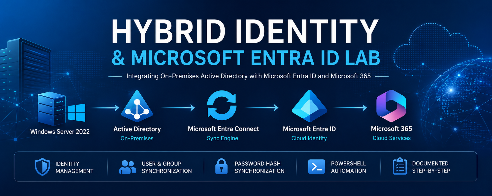

<p align="center">
    
</p>


---

# Hybrid Identity & Microsoft Entra ID Lab


---

# Overview

This repository documents the implementation of a **Hybrid Identity** environment by integrating an on-premises **Active Directory Domain Services (AD DS)** environment with **Microsoft Entra ID** and **Microsoft 365**.

The project simulates the deployment and administration of a real-world hybrid identity infrastructure commonly found in enterprise environments. It demonstrates how identities created and managed on-premises can be synchronized to the cloud using **Microsoft Entra Connect Sync**, enabling users to authenticate with Microsoft 365 services using synchronized credentials.

Each ticket represents a realistic administrative task performed by System Administrators, Microsoft 365 Administrators, Identity Administrators, and IT Support Professionals.

---

# Objectives

* Deploy a hybrid identity environment
* Integrate Active Directory with Microsoft Entra ID
* Configure Microsoft Entra Connect Sync
* Synchronize users and groups to Microsoft 365
* Configure Password Hash Synchronization (PHS)
* Validate hybrid authentication
* Troubleshoot synchronization issues
* Document enterprise administration procedures
* Develop practical Microsoft identity management skills

---

# Lab Environment

## On-Premises Infrastructure

| Component         | Configuration                        |
| ----------------- | ------------------------------------ |
| Hypervisor        | VMware Workstation Pro               |
| Domain Controller | DC01 — Windows Server 2022           |
| Sync Server       | SYNC01 — Windows Server 2022         |
| Active Directory  | AD DS                                |
| DNS               | Active Directory Integrated          |
| Domain            | adlab.local                          |
| DC01 Address      | 192.168.66.10                        |
| SYNC01 Address    | 192.168.66.30                        |
| Management        | Active Directory Users and Computers |
| Administration    | PowerShell                           |

---

## Cloud Infrastructure

| Component           | Configuration                  |
| ------------------- | ------------------------------ |
| Tenant              | Microsoft 365 Business Premium |
| Identity Provider   | Microsoft Entra ID             |
| Synchronization     | Microsoft Entra Connect Sync   |
| Authentication      | Password Hash Synchronization  |
| Administration      | Microsoft 365 Admin Center     |
| Identity Management | Microsoft Entra Admin Center   |

---

# Hybrid Identity Architecture

```text
                     Microsoft 365
                            ▲
                            │
                   Microsoft Entra ID
                Maggs777.onmicrosoft.com
                            ▲
                            │
              Microsoft Entra Connect Sync
               Password Hash Synchronization
                    OU-based filtering
                            ▲
                            │
                         SYNC01
                 Windows Server 2022
                 Domain: adlab.local
                 IP: 192.168.66.30
                            ▲
                            │
                           DC01
                AD DS + DNS / Windows Server 2022
                 IP: 192.168.66.10
                            ▲
                            │
                   Domain Users & Groups
```

Microsoft Entra Connect Sync is now operational on SYNC01. Selected on-premises identities are synchronized from Active Directory to Microsoft Entra ID using Password Hash Synchronization and a controlled OU synchronization scope.

---

# Technologies Used

## Identity & Directory Services

* Active Directory Domain Services (AD DS)
* Microsoft Entra ID
* Microsoft Entra Connect Sync
* Password Hash Synchronization (PHS)

## Microsoft Cloud

* Microsoft 365 Business Premium
* Microsoft 365 Admin Center
* Microsoft Entra Admin Center

## Windows Administration

* Windows Server 2022
* Windows 11
* PowerShell
* DNS
* Organizational Units (OUs)
* Security Groups
* User Management

## Version Control

* Git
* GitHub

---

# Skills Demonstrated

* Hybrid Identity Administration
* Active Directory Administration
* Microsoft Entra ID Administration
* Microsoft 365 Administration
* Identity Synchronization
* Password Hash Synchronization
* User Lifecycle Management
* Organizational Unit Design
* Security Group Administration
* Identity Troubleshooting
* PowerShell Administration
* Enterprise Documentation
* Technical Documentation
* IT Support Best Practices

---

# Project Roadmap

| Ticket  | Status | Description                                  |
| ------- | :----: | -------------------------------------------- |
| HYB-001 |    ✅   | Assess Active Directory Environment          |
| HYB-002 |    ✅   | Configure Active Directory UPN Suffix        |
| HYB-003 |    ✅   | Update User UPNs                             |
| HYB-004 |    ✅   | Install Microsoft Entra Connect Sync         |
| HYB-005 |    ✅   | Configure OU Filtering                       |
| HYB-006 |    ⏳   | Perform Initial Directory Synchronization    |
| HYB-007 |    ⏳   | Verify Synchronized Users                    |
| HYB-008 |    ⏳   | Configure Password Hash Synchronization      |
| HYB-009 |    ⏳   | Synchronize Active Directory Groups          |
| HYB-010 |    ⏳   | Troubleshoot Hybrid Identity Synchronization |

---

# Repository Structure

```text
Hybrid-Identity-Entra-ID-Lab
│
├── README.md
├── Ticket-Tracker.md
├── Commands-Used.md
├── LICENSE
│
├── Documentation
│   ├── HYB-001-AD-Environment-Assessment.md
│   ├── HYB-002-UPN-Suffix-Configuration.md
│   ├── HYB-003-User-UPN-Updates.md
│   ├── HYB-004-Entra-Connect-Installation.md
│   ├── HYB-005-OU-Filtering.md
│   ├── HYB-006-Initial-Directory-Synchronization.md
│   ├── HYB-007-Synchronized-User-Verification.md
│   ├── HYB-008-Password-Hash-Synchronization.md
│   ├── HYB-009-Group-Synchronization.md
│   └── HYB-010-Sync-Troubleshooting.md
│
├── Screenshots
│   ├── HYB-001-Assess-Active-Directory-Environment
│   ├── HYB-002-Configure-Active-Directory-UPN-Suffix
│   ├── HYB-003-Update-User-UPNs-for-Hybrid-Identity
│   ├── HYB-004-Install-Microsoft-Entra-Connect-Sync
│   ├── HYB-005-Configure-OU-Filtering
│   ├── HYB-006-Initial-Directory-Synchronization
│   ├── HYB-007-Verify-Synchronized-Entra-ID-Users
│   ├── HYB-008-Password-Hash-Synchronization
│   ├── HYB-009-Synchronize-AD-Security-Groups
│   └── HYB-010-Troubleshoot-Hybrid-Identity-Synchronization
│
└── Diagrams
    └── Hybrid-Identity-Architecture.png
```

---

# Learning Outcomes

By completing this lab, I will gain hands-on experience with:

* Preparing Active Directory for hybrid identity
* Configuring Microsoft Entra Connect Sync
* Managing synchronized identities
* Troubleshooting synchronization issues
* Administering Microsoft Entra ID
* Integrating on-premises infrastructure with Microsoft 365
* Understanding enterprise identity management workflows

---

# Current Implementation Status

The on-premises Active Directory environment has been assessed and prepared for hybrid identity. A cloud-compatible UPN suffix (`Maggs777.onmicrosoft.com`) has been configured and the enabled lab users have been updated to use the new UPN format.

A dedicated Windows Server 2022 synchronization server, **SYNC01**, was deployed with separate internal and NAT network interfaces. SYNC01 was joined to `adlab.local`, configured to use DC01 for internal Active Directory DNS resolution, and validated for domain connectivity and secure-channel health.

**Microsoft Entra Connect Sync is installed and operational on SYNC01.** The `adlab.local` Active Directory forest is connected to the `Maggs777.onmicrosoft.com` Microsoft Entra tenant using **Password Hash Synchronization (PHS)**.

HYB-005 expanded and validated the synchronization boundary using selective OU filtering. The `Company\\Users`, `Company\\Groups`, `Company\\Computers`, and `Company\\Servers` OUs are included in synchronization scope, while `Company\\Disabled Users` remains excluded. CLIENT01 is organized under the synchronized Computers OU and SYNC01 under the synchronized Servers OU.

OU-filtering behavior was validated using Emily Carter. While located in `Company\\Users`, her identity synchronized to Microsoft Entra ID and displayed **On-premises sync = Yes**. Moving the same Active Directory object to the excluded `Company\\Disabled Users` OU and running a delta synchronization caused the corresponding Entra identity to be soft-deleted. Returning Emily Carter to `Company\\Users` and synchronizing again automatically restored the cloud identity without a manual Entra restore.

The Microsoft Entra Connect scheduler was also validated with PowerShell. Automatic synchronization remains enabled with a 30-minute effective interval, delta synchronization policy, staging mode disabled, and the scheduler operating normally.

The project is now **5 / 10 tickets complete**. The next ticket is **HYB-006 — Perform Initial Directory Synchronization**, which will focus on documenting synchronization execution, monitoring, and successful completion.

---

# Screenshots

Project screenshots are organized by ticket within the `Screenshots` directory. The folder names mirror the ticket workflow so the implementation evidence can be followed in the same order as the project roadmap.

---

# Related Projects

* Microsoft 365 Administration Lab
* Active Directory Home Lab
* Windows Server Administration Lab
* CompTIA A+ Study Repository

---

# Future Enhancements

* Seamless Single Sign-On (Seamless SSO)
* Microsoft Entra Cloud Sync
* Microsoft Entra Connect Health
* Password Writeback
* Group Writeback
* Hybrid Azure AD Join
* Microsoft Intune Device Enrollment
* Conditional Access Policy Validation
* Self-Service Password Reset (SSPR)
* Multi-Factor Authentication (MFA)

---

# References

* Microsoft Learn
* Microsoft Entra ID Documentation
* Microsoft Entra Connect Documentation
* Windows Server Documentation
* Microsoft 365 Documentation
* PowerShell Documentation

---

**Project Status:** 🚧 In Progress

This repository is part of a larger enterprise lab portfolio focused on Windows Server, Active Directory, Microsoft Entra ID, Microsoft 365, identity management, and IT infrastructure administration.
